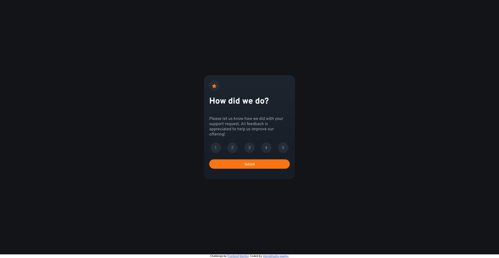

# Frontend Mentor - Interactive rating component solution

This is a solution to the [Interactive rating component challenge on Frontend Mentor](https://www.frontendmentor.io/challenges/interactive-rating-component-koxpeBUmI). Frontend Mentor challenges help you improve your coding skills by building realistic projects. 

## Table of contents

- [Overview](#overview)
  - [The challenge](#the-challenge)
  - [Screenshot](#screenshot)
  - [Links](#links)
- [My process](#my-process)
  - [Built with](#built-with)
  - [Useful resources](#useful-resources)
- [Author](#author)

## Overview

### The challenge

Users should be able to:

- View the optimal layout for the app depending on their device's screen size
- See hover states for all interactive elements on the page
- Select and submit a number rating
- See the "Thank you" card state after submitting a rating

### Screenshot

### Links

- Solution URL: [https://www.frontendmentor.io/solutions/simple-and-elegent-design-QuV-V7B_nU](https://www.frontendmentor.io/solutions/simple-and-elegent-design-QuV-V7B_nU)
- Live Site URL - 1: [https://interactive-rating-component-bed.pages.dev/](https://interactive-rating-component-bed.pages.dev/)
- Live Site URL - 2: [https://ultrahash.in/projects/interactive-rating-component](https://ultrahash.in/projects/interactive-rating-component)

## My process

### Built with

- HTML5
- CSS custom properties
- Flexbox
- Mobile-first workflow
- Javascript

### Useful resources

- [Fonts resource 1](https://fonts.google.com/) - This helped me get the necessary font style to complete this project.

## Author

- Website - [ultrahash.in](https://www.ultrahash.in)
- Frontend Mentor - [@ultra-hash](https://www.frontendmentor.io/profile/yourusername)

